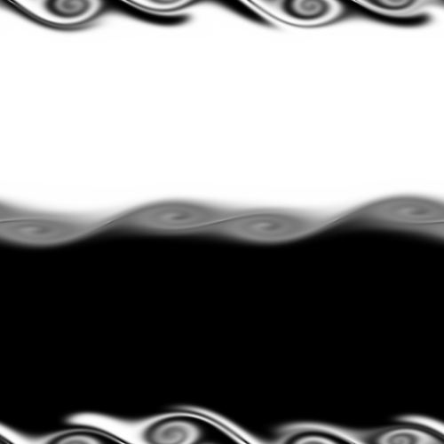

# Fluid Flow Simulation

This project implements a real-time 2D fluid flow simulation using a well-known method developed by Jos Stam. 
The simulation and visualization are written in C++, utilizing SDL2 for graphical output.

## Table of Contents

- [Overview](#overview)
- [Background](#background)
- [Methods](#methods)
- [Implementation](#implementation)
- [Usage](#usage)
- [Results](#results)
- [Project Structure](#project-structure)
- [References](#references)

---

## Overview

The simulation showcases how an incompressible fluid, governed by the Navier-Stokes equations, develops instability at the interface of regions with differing velocities. The dye-based visualization allows direct observation of vortex formation and mixing.

## Background

Kelvin–Helmholtz instability occurs when there is velocity shear in a single continuous fluid or between two fluids. Small disturbances at the interface grow, leading to turbulence and vortices. Real-time simulation of such flows is computationally intensive, but Stam's method provides a stable, efficient approach suitable for visualization.

## Methods

The simulation is based on the discretized incompressible Navier-Stokes equations:

- **Projection Method:** The velocity field is projected onto a divergence-free field to enforce incompressibility.
- **Periodic Boundary Conditions:** The fluid grid wraps in both x and y directions (torus topology).
- **Simulation Steps:**
  1. **Force Addition:** External forces perturb the fluid.
  2. **Advection:** Fluid properties are advected using the velocity field.
  3. **Diffusion:** Viscosity is applied using Fast Fourier Transform (FFT) due to periodic boundaries.
  4. **Projection:** The velocity field is made divergence-free in Fourier space.

A dye field is evolved alongside the velocity field to visualize the flow.

## Implementation

- **Language:** C++
- **Graphics:** SDL2 library for real-time rendering.
- **Main code:** Located in `src/fluid_flow.cpp`.
- **Build system:** Use the `Makefile` in the `src/` directory.
- **Visualization:** The dye concentration is mapped to pixel colors; users can interactively inject dye with the left mouse button.

### Arrays Allocation

- Four `N x (N+2)` arrays are used for velocity components (with extra columns for FFT).
- Force fields are stored separately and can be toggled during the simulation.

### Notable Features

- Interactive dye injection (left mouse button).
- Real-time rendering of vortex evolution.
- Simple mechanism for applying and removing forces.

## Usage

### Prerequisites

- C++ compiler
- SDL2 development libraries

### Building

1. Navigate to the `src/` directory:
   ```sh
   cd src
   ```
2. Run `make` to build the executable:
   ```sh
   make
   ```

### Running

- After building, run the simulation from the `run/` directory:
  ```sh
  ./fluid_flow
  ```
- The GUI window will display the evolving fluid flow.
- Use the left mouse button to add a circular blob of dye for visual study.

## Results

The simulation produces evolving patterns that visualize the KH instability. Below are sample outputs at various simulation steps:

| 20 steps | 100 steps | 300 steps | 500 steps |
|----------|-----------|-----------|-----------|
|  |  |  |  |

Another scenario applies a leftward force to a central region:

| 20 steps | 100 steps | 300 steps | 500 steps |
|----------|-----------|-----------|-----------|
|  |  |  |  |

- Increasing viscosity causes the fluid to stabilize quickly.
- Decreasing viscosity enhances instability and vortex formation.


## References

- Jos Stam. 2001. "A Simple Fluid Solver Based on the FFT." _Journal of Graphics Tools_, 6(2), 43–52. [doi](https://doi.org/10.1080/10867651.2001.10487540)
- Jos Stam. 1999. "Stable fluids." _SIGGRAPH '99_. ACM Press/Addison-Wesley Publishing Co., USA, 121–128.
- [SDL2 Library GitHub](https://github.com/libsdl-org/SDL)
- [Kelvin–Helmholtz instability (Wikipedia)](https://en.wikipedia.org/wiki/Kelvin%E2%80%93Helmholtz_instability)

---

For further details, see the full [report.pdf](report.pdf).
